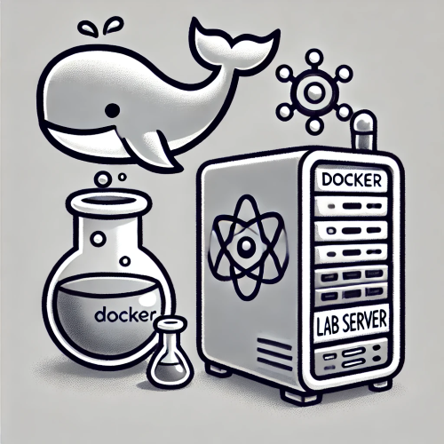
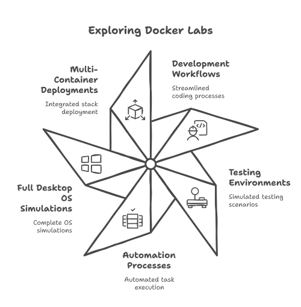
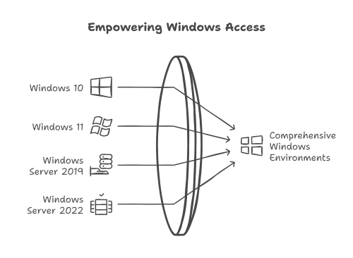
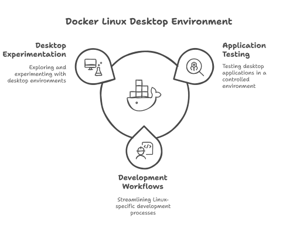
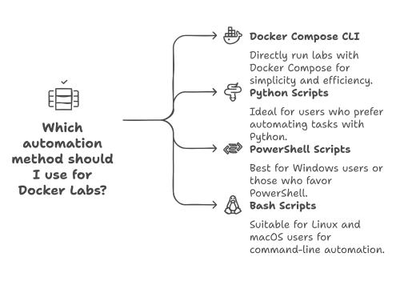
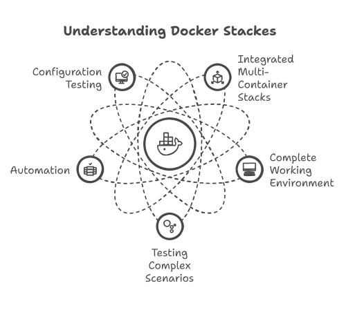

# Docker Labs: Empowering Your Testing and Automation Journey


Welcome to **Docker Labs**—a curated collection of containerized environments designed to streamline your development, testing, and automation workflows. With Docker Labs, you can simulate full desktop operating systems or deploy integrated multi-container stacks to thoroughly test your configurations and automation scripts.

## What Are Docker Labs?

Docker Labs offer pre-configured Docker images and stacks that mirror real-world environments. They empower you to:

- **Test and Develop:** Quickly spin up environments without the overhead of traditional VMs.
- **Validate Configurations:** Experiment with automation scripts and system settings in isolated, production-like settings.
- **Streamline Workflows:** Ensure consistency across development, testing, and production stages.



## Curated Environments

Docker Labs provide a diverse range of environments to suit your testing needs:

### Full Windows Environments



Experience complete Windows operating systems, including:

- **Windows 10 & Windows 11**
- **Windows Server 2019 & Windows Server 2022**
- You can add more just by copying one of the predefined folders and changing the build value

| Value | Version                | Size  |
|-------|------------------------|-------|
| 11    | Windows 11 Pro          | 5.4 GB|
| 11l   | Windows 11 LTSC         | 4.2 GB|
| 11e   | Windows 11 Enterprise   | 5.8 GB|
| 10    | Windows 10 Pro          | 5.7 GB|
| 10l   | Windows 10 LTSC         | 4.6 GB|
| 10e   | Windows 10 Enterprise   | 5.2 GB|
| 8e    | Windows 8.1 Enterprise  | 3.7 GB|
| 7e    | Windows 7 Enterprise    | 3.0 GB|
| ve    | Windows Vista Enterprise| 3.0 GB|
| xp    | Windows XP Professional | 0.6 GB|
| 2025  | Windows Server 2025     | 5.0 GB|
| 2022  | Windows Server 2022     | 4.7 GB|
| 2019  | Windows Server 2019     | 5.3 GB|
| 2016  | Windows Server 2016     | 6.5 GB|
| 2012  | Windows Server 2012     | 4.3 GB|
| 2008  | Windows Server 2008     | 3.0 GB|
| 2003  | Windows Server 2003     | 0.6 GB|

These images let you test Windows-based applications and services without managing multiple physical or virtual machines.

### Full Linux Desktop



Launch a comprehensive Linux desktop environment right within Docker. This setup is perfect for:

- Desktop application testing
- Linux-specific development workflows
- Experimenting with various desktop environments

## Introducing Docker Stacks

Docker Stacks are integrated multi-container stacks that simulate interconnected systems for testing complex scenarios. They allow you to validate automation and configuration across multiple applications in one go.

### Example Stack: Cribl, Splunk, and Portainer

Imagine a scenario where you need a robust log analytics pipeline. With Docker Stacks, you can deploy:

- **Cribl:** For real-time data routing and processing.
- **Splunk:** For comprehensive log analysis.
- **Portainer:** For managing and visualizing your Docker environments.

Deploying these applications together in a single stack helps you verify the interactions and integration of your automation scripts across multiple services.

## Running Your Lab Environments



Each lab in Docker Labs can be started in one of three ways:

1. **Using the Docker Compose CLI:**  
   Run your labs directly with Docker Compose.
   - docker compose up -d
   - or
   - docker compose up --build -d
   - docker compose down
2. **Using Automation Scripts:**  
   Each lab directory includes scripts for:
   - **Python**
   - **PowerShell**
   - **Bash**
   - **Batch**
3. **Using Terraform:**  
   - terraform init
   - terraform apply
   - terraform destroy

Choose the option that best suits your workflow.

### Example: Starting a Docker Stack with Docker Compose

To launch a Docker Stack, simply execute:

```bash
Bash:

docker-compose -f docker-stack.yml up -d
```

Alternatively, if you prefer using one of the provided automation scripts, navigate to the lab’s directory and run the appropriate command:

```python
Python

python build_and_run.py
```

```PowerShell
PowerShell

.\build_and_run.ps1
```

```bash
Bash

./build_and_run.sh
```

```Text
Batch

build_and_run.bat
```

Take your pick and start your lab environment with the tools you’re most comfortable using!

## Benefits of Docker Labs and Docker Stacks



- **Rapid Prototyping:** Launch fully functional environments with just a few commands.
- **Consistency:** Ensure every team member works in an identical environment, mitigating the "it works on my machine" problem.
- **Flexibility:** Test multiple configurations and applications concurrently.
- **Simplified Management:** Leverage Docker’s ecosystem to manage, monitor, and scale your testing environments effortlessly.

## Getting Started with Docker Labs

Follow these steps to dive into Docker Labs:

1. **Install Docker:** Ensure Docker is installed and running on your system.
2. **Pull the Docker Labs Images:** Access our curated repository of Docker images.
3. **Deploy a Lab or Stack:** Use Docker Compose or one of the provided automation scripts to launch your environment.
4. **Customize and Test:** Modify configurations, implement automation scripts, and explore new setups—all within a controlled, containerized environment.

## Conclusion

Docker Labs revolutionize the way you build and test environments by offering full Windows and Linux desktops alongside integrated Docker Stacks. Whether you’re fine-tuning automation scripts or conducting comprehensive tests across multiple applications like Cribl, Splunk, and Portainer, Docker Labs empower you to work smarter, faster, and more reliably.
